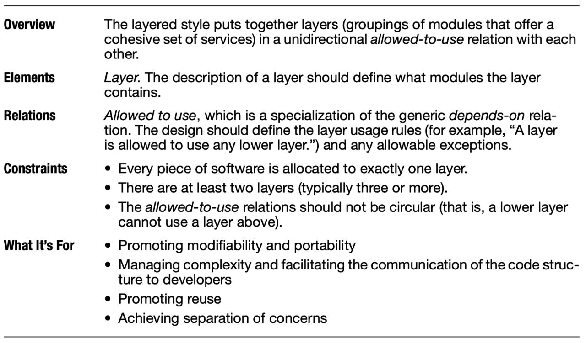

# Описание лабораторного курса по дисциплине: "Проектирование вычислительных систем"

## Цель лабораторного курса: 

- сформировать целостное представление о вычислительной системе;
- освоить базовые инструменты проектирования вычислительных систем (архитектурные стили).

Форма контроля лабораторного курса: зачёт.

## Общие требования

1. В качестве материала для анализа в лабораторных работах 1, 2 следует использовать предстоящий дипломный проект или ранее выполненный курсовой проект (далее - исследуемый проект). В случае если по мнению студента это невозможно - проблема решается в индивидуальном порядке.
2. Отчёты должны быть подготовлены в виде законченных документов, оформленных в соответствии с принятыми нормами. Используемые в отчёте графические материалы должны умещаться на листе, быть читаемыми, снабжены легендой, отвечать базовым принципам композиции.
3. Отчеты о выполненных лабораторных работах принимаются в распечатанном виде. В случае успешной защиты, на отчёт ставится соответствующая отметка, после чего защищённые отчёты хранятся у студента и предъявляются при защите последующих лабораторных работ. После защиты последнего отчёта полный комплект отчётов сдаётся преподавателю, в зачётной ведомости делается соответствующая отметка. Лабораторный курс можно считать законченным.
4. Объём каждого пункта в составе любого из отчётов должен быть не более одной страницы. Отчёты должны быть по возможности краткими.
5. В процессе защиты отчета могут задаваться вопросы касательно архитектурных проблем, понятий вычислительной системы, архитектуры вычислительной системы и архитектурных стилей; методов и подходов к принятию архитектурных решений; рассматриваемого проекта. Отчёты не должны противоречить друг другу.

## Литература:

[1] ISO/IEC/IEEE 42010 Systems and software engineering — Architecture description или ГОСТ Р 57100-2016/ISO/IEC/IEEE 42010:2011 Системная и программная инженерия. Описание архитектуры.

[2] ISO/IEC/IEEE 15288:2015 Systems and software engineering -- System life cycle processes или ГОСТ Р ИСО/МЭК 15288-2005. Информационная технология. Системная инженерия. Процессы жизненного цикла систем.

[3] Clements, P., Garlan, D., Bass, L., Stafford, J., Nord, R., Ivers, J., & Little, R. (2002). Documenting software architectures: views and beyond. Pearson Education.

## Состав лабораторных работ

### Лабораторная работа № 1

Цель: приобретение навыков анализа вычислительных систем с архитектурной точки зрения.

Содержание отчёта:
1. Краткое описание исследуемого проекта в свободной форме. Должно позволить сформировать общее представление о проекте, его цели и особенностях. Будьте конкретны.
2. Краткое описание жизненного цикла проекта. Основные этапы и их роль для системы в целом. Используемые методы и средства.
    - Необходимо описать жизненный цикл *вашей* системы, главное - его структура. Типовой жизненный цикл является лишь примером, а не результатом.
    - Жизненный цикл не подразумевает строгой последовательности этапов. Отдельные этапы могут выполняться как полностью или частично параллельно.
3. Анализ архитектурных проблем исследуемого проекта (не менее 5 штук).
    - Архитектурные проблемы - это то, в рамках чего должны приниматься архитектурные решения.
    - Проблемы, полученные вследствие ваших архитектурных решений, - вторичны и не очень интересны. Пример: сильная нормализованность данных - это следствие использования реляционной БД.
4. Выводы.

### Лабораторная работа № 2

Цель: документирование и проектирование архитектуры вычислительных систем.

Содержание отчёта:
1. Анализ доступных инструментов архитектурного проектирования и их применимости к решению выявленных архитектурных проблем исследуемого проекта. Анализ подразумевает наличие вариантов с неочевидным выбором. Основной приоритет - практическая значимость.
    - Речь идёт об инструментах архитектурного проектирования (языки архитектурного описания, архитектурные стили), а не об инструментах, решающих вашу архитектурную проблему (библиотеки, патерны, операционные системы и т.п.).
    - В большинстве случаев нет необходимости использовать инструмент архитектурного проектирования в полном объёме (к примеру, не нужен столь глубокий уровень детализации) или в чистом виде (без примеси элементов других инструментов). Данные вопросы также являются предметом анализа.
2. Документирование архитектурных решений, направленных на решения выявленных архитектурных проблем исследуемого проекта (не менее 3 штук).
    - В большинстве случаев ожидается схемное описание принятых вами решений. 
    - В случае, если есть несколько альтернатив, желательно отобразить несколько из них.
    - Необходимо продемонстрировать владение как минимум двумя инструментами архитектурного проектирования.
3. Выводы.

В процессе защиты вам может быть предложено альтернативное решение для части из описанных задач, в этом случае необходимо подготовить приложение к отчёту с комплексным сравнительным анализом.

### Лабораторная работа № 3

Цель: приобретение навыков разработки инструментов проектирования архитектурного уровня (язык документирования архитектуры или архитектурный стиль).

Содержание отчёта:
1. Сформулировать задачу архитектурного проектирования.
    - Удачные примеры можно видеть в [3], к примеру, таблица 2.4, резюме по уровневому стилю, разделы 'Overview' и 'What It's For' (см. рисунок ниже).
    - Допустимо несоответствие темы рассмотренного ранее проекта и рассматриваемой задачи архитектурного проектирования.
2. Привести описание разработанного / модифицированного / скомпилированного инструмента проектирования архитектурного уровня. Привести пример использования.
    - Удачные примеры можно видеть в [3], а также на рисунке ниже есть примеры текстового описания в разделах 'Elements', 'Relations', 'Constrains'.
3. Разработать критерии оценки инструмента архитектурного проектирования.
    - Рекомендуется сформулировать такие критерии, по каждому их которых по отдельности вы сможете установить отношение [нестрогого частичного порядка](https://ru.wikipedia.org/wiki/Отношение_порядка) с аналогичными/сравнимыми инструментами.
4. Провести сравнительный анализ с другими инструментами в соответствии со сформулированным критериями.
    - Результат рекомендуется представить в виде таблицы где строки - критерии, колонки - инструменты, ячейки - натуральные числа (больше - лучше).
5. Выводы, включая анализ полученных в результате сравнения данных.

В процессе защиты вам могут быть предложены альтернативные инструменты архитектурного проектирования для сравнения. Вы должны быть способны аргументировать любую из данных вами оценок. Вам может быть предложен новый критерий для сравнения. Вас могут попросить продемонстрировать знание сравниваемых вами инструментов.

